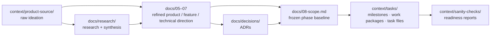

# Documentation index

This folder holds the project's authoritative working documents.

## Numbering convention

Top-level docs use a numeric prefix (`01..08`). The convention is **stability-first**: the lowest numbers are the documents that are always present in every project; higher numbers are project-shaping documents that may be filled in incrementally or, in some projects, stay minimal.

**Numbering is stable.** Once assigned, a number is never reused for a different document. If a project does not need `06-feature-blueprint.md`, the file may stay minimal or be deleted, but `06` is not reassigned to something else. This protects cross-doc references over time.

| File | Purpose | Stability |
|---|---|---|
| [`01-working-rules.md`](01-working-rules.md) | Operational rules for current implementation work | **Always present** |
| [`02-git-workflow.md`](02-git-workflow.md) | Git, branching, commits, merges, tags, releases, CHANGELOG | **Always present** |
| [`03-planning-model.md`](03-planning-model.md) | Milestones, work packages, task files, readiness reports | **Always present** |
| [`04-runbook.md`](04-runbook.md) | Operational quick-reference (commands, environments, demo flows) | **Always present** |
| [`05-product-context.md`](05-product-context.md) | Who/what/why for the project | Project-shaping |
| [`06-feature-blueprint.md`](06-feature-blueprint.md) | Capability outline | Project-shaping |
| [`07-technical-direction.md`](07-technical-direction.md) | Bootstrap-time stack and initial architecture direction (living counterpart at `09`) | Project-shaping |
| [`08-scope.md`](08-scope.md) | Frozen scope baseline for the active phase (renamed per phase) | Project-shaping |
| [`09-architecture.md`](09-architecture.md) | Living architecture doctrine (counterpart to `07`) | Engineering doctrine (living) |
| [`10-testing-strategy.md`](10-testing-strategy.md) | Living testing-strategy doctrine | Engineering doctrine (living) |
| [`11-engineering-practices.md`](11-engineering-practices.md) | Living engineering-practices doctrine | Engineering doctrine (living) |
| [`decisions/`](decisions/) | ADRs (Architecture Decision Records) | Folder; each ADR has its own status |
| [`research/`](research/) | Optional: research docs and synthesis trail | Folder; activate when research is part of the workflow |

Reserved: `12+` for future-phase scope documents (e.g., `12-mvp-scope.md` after `08-poc-scope.md` closes). The `09`–`11` slots are reserved for the engineering-doctrine layer.

## Project document layers

The way ideas become executable work in this project:

- **Ideation** — raw idea documents in `context/product-source/`. Not authority. AI reads on demand at project start.
- **Refined direction** — `docs/05–07` consolidate ideation into stable, AI-readable framing. Research / synthesis (when used) feeds this layer.
- **Binding decisions** — ADRs in `docs/decisions/` capture decisions that have cross-cutting consequences.
- **Frozen phase baseline** — `docs/08-scope.md` is the authoritative scope for the current phase, citing refined direction and ADRs.
- **Engineering doctrine (living)** — `docs/09–11` index current architecture, testing strategy, and engineering practices. Descriptive; binding lives in ADRs, working rules, and scope baselines. Doctrine evolves through planning conversations, audit responses, and work-package closures per `docs/09-architecture.md` §4.
- **Executable work** — milestones and work packages in `context/tasks/` execute against the scope; readiness reports in `context/sanity-checks/` capture closure evidence.

The arrows are one-way: insights from ideation flow forward into refined docs and decisions, not the other way around. A decision recorded in an ADR does not edit the ideation; a scope freeze does not edit the technical direction (it cites it).

## Discovery

The single source of truth for "where do I find rule X?" is [`03-planning-model.md` §13](03-planning-model.md). Read it first when you don't know which doc to consult.
